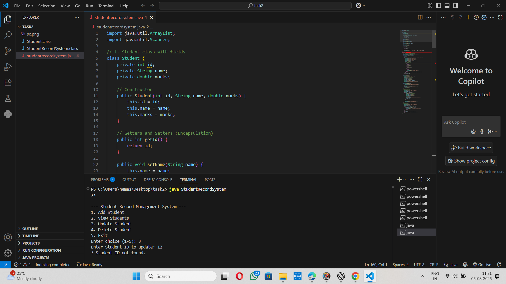

# 🎓 Java Student Records App

A simple **Command-Line Interface (CLI)** based Java application to manage student records like **ID**, **Name**, and **Marks** using `ArrayList`.

---

## 👤 Author

**Hema**  
🔗 GitHub Repo: [JavaStudentRecordsApp](https://github.com/Hemasripatkuri4/JavaStudentRecordsApp/tree/main)

---

## 🧰 Tools Used

- Java SE (JDK 17 or above)
- Visual Studio Code / IntelliJ CE
- Git & GitHub
- Command Prompt / Terminal

---

## ✅ Features

- ➕ Add a new student  
- 📄 View all students  
- 🔁 Update student details by ID  
- ❌ Delete a student record  
- 🚪 Exit the system  

---

## 🔑 Concepts Practiced

- Java Classes and Objects  
- Encapsulation (private fields + getters/setters)  
- ArrayList Collection  
- Loops and conditionals  
- Constructor overloading  
- Java CLI operations  

---

## 📸 Screenshot



> Make sure `screenshot.png` is placed in the root of your GitHub repository.

---

## ▶️ How to Run

1. Open terminal in the project folder:

```bash
cd path/to/JavaStudentRecordsApp

